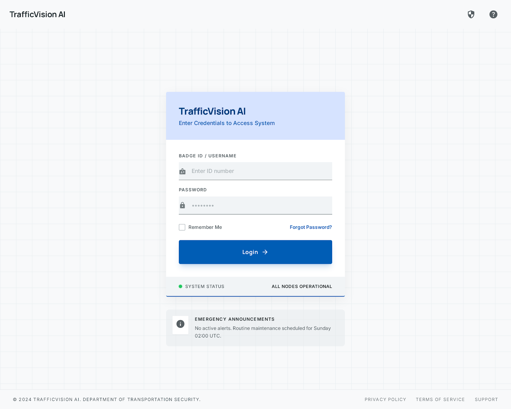
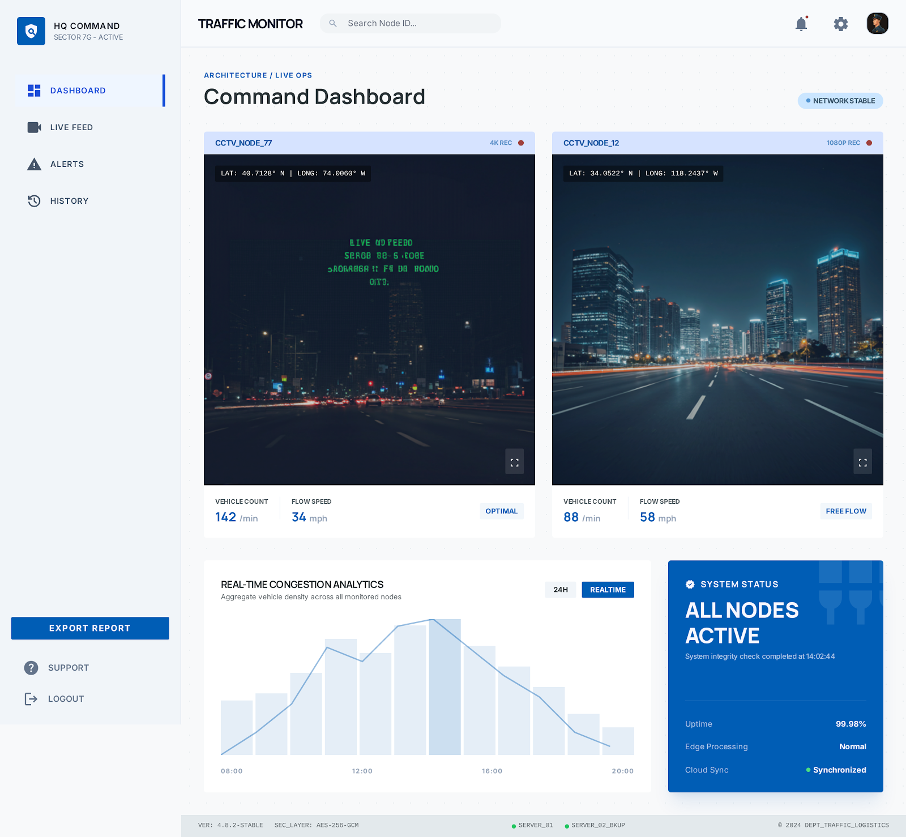
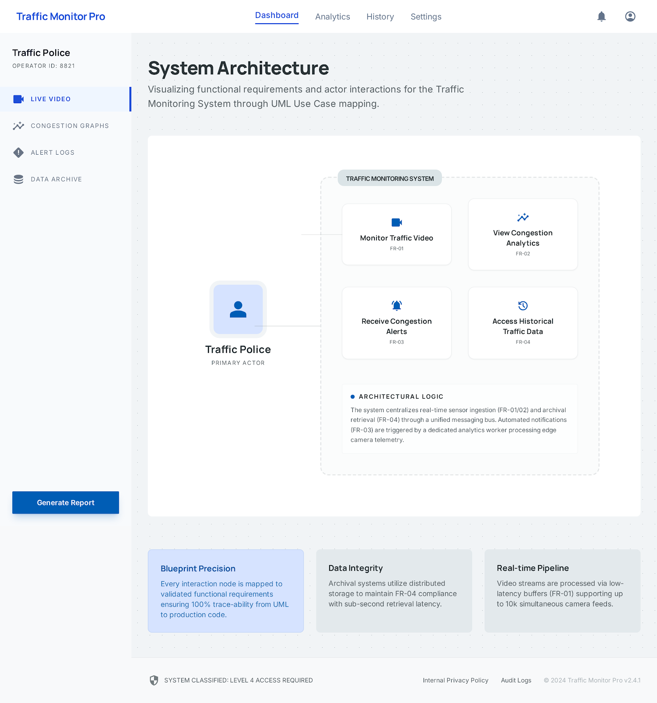
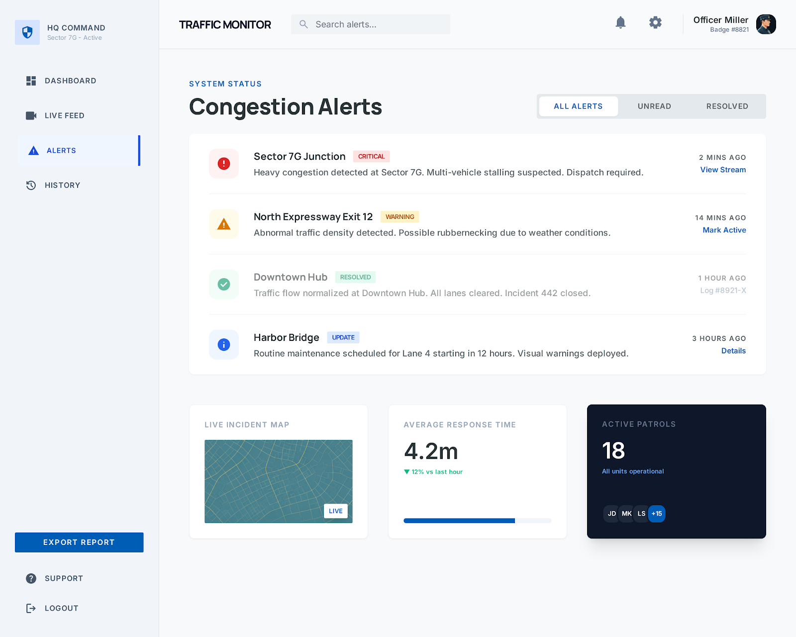
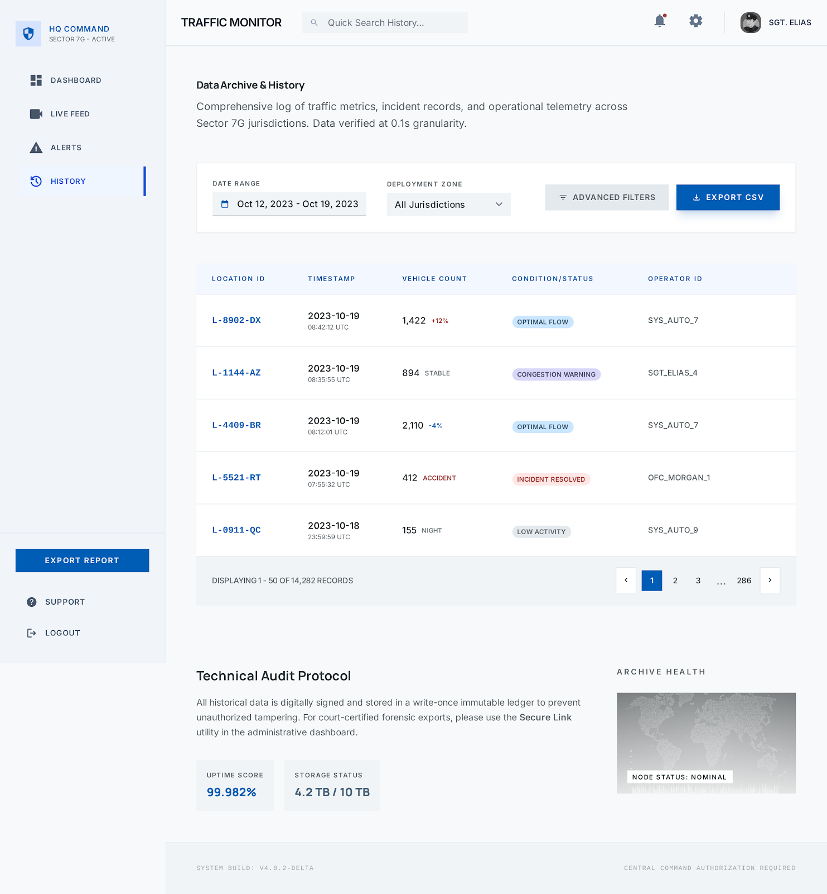

# Portal Asesu (Authentication & Security)

*Login Autentikasaun*

Operadór sira tenke hatama kreduisiál ne'ebé validu:
 **Badge ID / Username**: Identifikasaun úniku ba polísia ka operadór (Ez: ID Badge #8821).
 **Password**: Proteje ho enkripsaun naruk hodi evita asesu husi ema ne'ebé la iha autorizasaun.

# 1 Dashboard Sistema Monitorizasaun Tráfik

### Dashboard Prinsipál (Dashboard - Monitor Tráfegu)
Hatudu geral cctv iha sidade nian tomak.
---
##  Vizaun Jerál
Sistema ida-ne'e dezenvolve hodi fó vizualizasaun dadus tráfiku nian iha tempu reál (*real-time*). Ida-ne'e ajuda polísia tránzitu atu monitoriza movimentu veíkulu, detekta Engrafamentu, no fó resposta lalais ba kualkér insidente liuhusi integrasaun AI no rede CCTV.

## Developer 
* **Métrika Importante:**
    * `Vehicle Count`: Totál veíkulu ne'ebé liubá kada Segundo/minutu.
    * `Flow Speed`: Velosidade médiu veíkulu nian (mph/kph).
* **Analítika Kongestaun:** Gráfiku área ne'ebé hatudu trend densidade husi oras 08:00 to'o 20:00.
---
## 2 LIVE 

* **Live kada fatin CCTV:**

Polísia Tránzitu nu'udar **Aktór Prinsipál** ne'ebé iha fonsionalidade tolu (3) boot:
* **FR-01: Monitor Traffic Video** – Haree vídeo diretu husi kamera tráfiku nian.
* **FR-02: View Congestion Analytics** – Analiza dadus Engrafamentu ne'ebé sistema foti ona.
* **FR-03: Receive Congestion Alerts** – Simu notifikasaun automátiku wainhira iha problema iha estrada./base on Parameter Developer.
  * jadi ida ne ita bele hare kada CCTV ida ida 
  * CCTV1 : 
  * CCTV2
  * CCTV3
* **Métrika Importante:**
    * `Vehicle Count`: Totál veíkulu ne'ebé liubá kada Segundo/minutu.
    * `Flow Speed`: Velosidade médiu veíkulu nian (mph/kph).
* **Analítika Kongestaun:** Gráfiku área ne'ebé hatudu trend densidade husi oras 08:00 to'o 20:00.

### 3. Sistema Alerta (Notifikasaun)

**Pájina ida-ne'e fó prioridade ba kazu tráfegu sira ne'ebé presiza atensaun imediata husi operadór ka polísia iha terrenu**.

Sistem avizu automátiku ba kazu sira ne'ebé akontese iha estrada hanesan Engrafamentu .
#### A. Kategoria Alerta
Sistema uza kódigu kór hodi fahe nivel urjénsia:
* 🔴 **CRITICAL (Sector 7G Junction)**: Engrafamentu  todan ,no veíkulu mak soke malu. Presiza haruka Police ba hare(*Dispatch*) agora kedas.
* 🟡 **WARNING (ENgrafamentu Liu 5 minutu )**: Densidade tráfegu la normál.
* 🔵 **UPDATE (Harbor Bridge)**: Avizu ba manutensaun rutina ne'ebé sei akontese. bainhira Veikulus lao normanl 

### 4. Dadus Istóriu (Analiza & Relatóriu)

Pájina ida-ne'e serve nu'udar baze de dadus sentrál ne'ebé rai rejistu tráfegu hotu ho kualidade aas 
* **Filtru**: Tuir ID Kamera, Tempu, ka Tipu veikulu.
* **Esporta**: Suporta formatu `.csv` no `.pdf` ba relatóriu ofisiál polísia nian.
